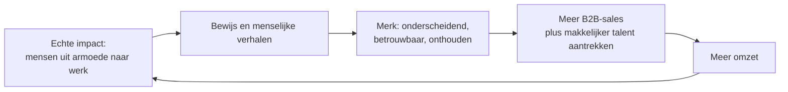
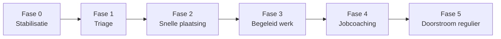

# Rocadelo Impact: recruiting met een reintegratie-motor

## Kernidee in één zin
Rocadelo HR blijft in de kern een commercieel recruitingbureau, maar bouwt daarnaast een echte reintegratie-motor die mensen van armoede naar duurzaam werk brengt. De impact is oprecht gemeend en is precies daardoor ook een groeimotor: ze maakt het merk bekender en betrouwbaarder, wat de gewone sales voedt.

**Voorwaarde die alles draagt:** de missie komt eerst, de merkwinst is het gevolg. Draai je dat om, dan voel je het en verlies je net het vertrouwen dat je wou winnen.

## De kern in één beeld

---

# Deel 1 tot De impact-motor: van straat naar een job die standhoudt

## Het grondprincipe (wat de evidence zegt)

Twee bewezen inzichten draaien de intuïtieve aanpak om.

**1. Stabiliseren komt eerst (Housing First-logica).** Je kunt geen job vasthouden vanaf de straat, zonder ID, zonder bankrekening, met onbehandelde gezondheids- of verslavingsproblemen. Snel een stabiele plek geven is een *voorwaarde* voor al de rest, niet een beloning achteraf. Het bewijs is sterk: hogere woonretentie, lagere kost (elke geinvesteerde euro levert ongeveer 1,44 euro besparing op), en in de grote Canadese studie At Home/Chez Soi zaten deelnemers 73% van hun tijd in stabiele huisvesting tegenover 32% bij de klassieke aanpak.

Belangrijke nuance, en meteen het argument voor jouw combinatie: stabiele huisvesting stabiliseert wel, maar produceert op zichzelf géén werk. De VK-pilot zag sterke huurcontract-behoud, maar weinig verandering in werk of opleiding. Wonen alleen is dus niet genoeg. Werk-begeleiding alleen ook niet. Samen wel.

**2. Place-then-train verslaat train-then-place.** De klassieke reflex ("leid ze eerst op, plaats ze dan") is voor mensen met grote drempels de minst effectieve route. Het best onderzochte model, Individual Placement and Support (IPS), doet het omgekeerd: snel in een echte, betaalde job op de gewone arbeidsmarkt, met doorlopende coaching ernaast. Er is overweldigend internationaal bewijs dat dit leidt tot hogere tewerkstelling, langere jobduur en hogere lonen dan voortraining of beschut werk.

De acht IPS-principes die het laten werken:
1. Zero-exclusion: iedereen die wil, mag meedoen (keuze van de persoon, geen voorselectie).
2. Focus op echt, betaald werk op de gewone markt.
3. Vertrekken vanuit de voorkeuren van de persoon.
4. Snelle jobzoektocht (weken, niet maanden voortraining).
5. Systematische opbouw van werkgeversrelaties.
6. Onbeperkte begeleiding in de job, voor werknemer én werkgever.
7. Begeleiding rond uitkeringen en werk-incentives (de "benefits trap", zie valkuilen).
8. Integratie met gezondheids- en andere hulp.

## De pijplijn (6 fasen)

| Fase | Wat | Waarom |
|------|-----|--------|
| 0. Stabilisatie | Basis: veilige plek, eten, water, douche, ID, rekening, toegang tot zorg. Jouw laag 1. | Zonder bodem houdt geen job stand. |
| 1. Triage | Bepaal de afstand tot werk: bijna werkklaar, middelgrote afstand, grote afstand. | Niet iedereen zit op hetzelfde punt; de route verschilt. |
| 2. Snelle plaatsing | Zo snel mogelijk in echt betaald werk, mét coaching (IPS). Voor de grootste afstand kan een begeleide tussenstap eerst. | Snel echt werk werkt beter dan lang oefenen. |
| 3. Begeleid werk (enclave) | Een opstap-job in een beschermde omgeving of een begeleid team binnen een gastbedrijf. | Bouwt werkritme, referenties en een track record op. |
| 4. Jobcoaching | Doorlopende coaching in de job, ook richting de werkgever. | Retentie is het echte spel: plaatsen is makkelijk, iemand na 6 tot 12 maanden nog in de job hebben is moeilijk. |
| 5. Doorstroom | Van begeleid werk naar een gewone job bij een klant-werkgever. | Hier plugt de Rocadelo-recruitingmotor in: matchen van kandidaat aan werkgever. |

## De valkuilen (recht voor de raap)

- **Retentie boven plaatsing.** Meet niet "hoeveel geplaatst," maar "hoeveel na 12 maanden nog aan het werk." Als je daarop niet stuurt, ziet het er goed uit op papier en faalt het in het echt.
- **De benefits trap.** Als werken betekent dat iemand uitkeringen verliest en er financieel op achteruitgaat, dan stopt die persoon rationeel. Reken dit expliciet door per kandidaat (IPS-principe 7).
- **De werkgeversdrempel.** Werkgevers aarzelen bij deze doelgroep. Jouw taak is de aanwerving ontrisken (proefperiode, jobcoach mee, garanties). Dat is meteen een verkoopargument dat Rocadelo kan claimen.
- **Financiering van fase 0.** Stabilisatie is kost, geen omzet. Daarvoor bestaan subsidie en partners (zie hieronder). Bouw dit niet zelf van nul; werk samen met OCMW, VDAB, bestaande opvang en maatwerkbedrijven.
- **Bekende implementatie-val:** versnipperde financiering en slechte samenwerking tussen organisaties zijn de grootste struikelblokken bij dit soort trajecten. Los dit op met heldere afspraken en één regie.

## Waarom dit haalbaar is in België

Jouw model bestaat in Vlaanderen al als officiele, gesubsidieerde structuur: de sociale economie en de maatwerkbedrijven.

- De overheid betaalt via het werkondersteuningspakket 40 tot 75% van de loonkost van een doelgroepwerknemer (loonpremie), plus een begeleidingspremie die expliciet gericht is op doorstroom naar de gewone economie.
- De sector draait samen ongeveer 429 miljoen euro omzet, waarvan 83,5% B2B en B2G, met zo'n 27.000 werknemers. Bewijs dat het model op schaal werkt én winstgevend kan zijn.
- Minstens 4,5% van alle Vlaamse ondernemingen met een jaarrekening werkt al samen met een maatwerkbedrijf. De vraag bestaat dus.
- Het "enclave"-model (een begeleid team dat op de werkvloer van een klant werkt) is precies fase 3 hierboven.
- Aandachtspunt bij erkenning als maatwerkbedrijf: minimaal 20 voltijdse doelgroepwerknemers op jaarbasis, minstens 55% met een langdurige arbeidsbeperking, en de rechtsvorm vzw of vennootschap met sociaal oogmerk. Dat is een latere drempel, niet iets voor dag één.

---

# Deel 2 tot De flywheel aan Rocadelo haken

## Hoe impact concreet sales wordt (mechanisme, geen magie)

De flywheel draait alleen als je vier hefbomen concreet maakt.

1. **Bewijs boven claims.** Publiceer echte cijfers: X mensen geplaatst, Y% nog aan het werk na 12 maanden. Transparantie is het tegengif tegen purpose-washing. B2B-kopers rekenen je vandaag na.
2. **Verhaal-gedreven content.** Individuele, menselijke verhalen (met toestemming) zijn je meest deelbare en best onthouden marketingasset. Hier plugt jouw content-vaardigheid (video, Remotion) rechtstreeks in: de impact-tak wordt een contentmotor.
3. **B2B-waarde die aansluit.** Aankoopteams wegen steeds meer sociale waarde en ESG mee. Bied klanten een manier om diverse of ondervertegenwoordigde mensen aan te werven, en om die impact te rapporteren. Sommige klanten hebben inclusie-doelen die jij helpt halen.
4. **Talentmagneet en moat.** Mensen willen werken voor een bedrijf met betekenis, en een concurrent kan een échte missie niet namaken. Dat is een verdedigbare voorsprong.

## Gedeelde motor: je 7-agent stack hergebruiken

De AI-infrastructuur die je al bouwde voor commerciele recruiting is grotendeels herbruikbaar voor de impact-tak. Zo blijft de meerkost laag.

| Agent | Commerciele kant | Impact-kant |
|-------|------------------|-------------|
| Signal Detector | Vind koop- of hiring-signalen | Vind werkgevers open voor deze doelgroep |
| Lead Scorer | Score en fit van leads | Readiness en fit van kandidaten inschatten |
| Message Writer | Outreach naar prospects | Outreach naar werkgevers en partners |
| Reply Handler | Antwoorden opvolgen | Opvolging kandidaat en werkgever |
| Meeting Qualifier | Kwalificeer meetings | Screen en plan matchgesprekken |
| Performance Analyst | Sales-KPIs | Retentie- en doorstroom-KPIs |

Let op: de AI en de outreach transfereren wél, de menselijke case-management en coaching niet. Dat deel is arbeidsintensief mensenwerk en haal je best via partners binnen.

## Structuur: twee entiteiten, één merk

- **Rocadelo HR (commercieel):** de motor, de financiering en de plaatsingskracht.
- **Rocadelo Impact (sociale tak, werktitel):** de stabilisatie-, opleidings- en begeleid-werk-pijplijn. In België logisch als vzw of vennootschap met sociaal oogmerk, mogelijk later erkend binnen de sociale economie, wat de subsidies ontgrendelt.

Ze delen merk en technologie, maar zijn financieel en juridisch gescheiden. Dat maakt de missie structureel ingebed (niet decoratief), houdt de cijfers zuiver, en is precies wat purpose-washing tegengaat.

## De valkuilen (Deel 2)

- **Purpose-washing.** Zie hierboven: opgelost met echte cijfers plus structurele inbedding.
- **Merkverwarring.** Klanten mogen niet denken dat je énkel ex-daklozen plaatst; dat schrikt commerciele klanten af. Positionering: "een sterk recruitingbureau dat óók een echte reintegratie-motor draait," niet "het dakloze-recruitmentbureau."
- **Bandbreedte.** De impact-tak is operationeel zwaar. Bolt het niet aan als bijproject; het vraagt eigen mensen of partners. Bouw op bestaande organisaties (OCMW, VDAB, opvang, maatwerkbedrijven) in plaats van het hele sociale apparaat zelf op te zetten.

---

# Aannames (expliciet gemaakt)

1. Rocadelo's AI- en outreach-infrastructuur is grotendeels herbruikbaar voor de impact-tak. Deels waar: de tech transfereert, het menselijke begeleidingswerk niet.
2. Het Belgische subsidiekader is bruikbaar, mits je in Vlaanderen werkt en (op termijn) erkenning haalt, met de bijhorende voorwaarden.
3. Werkgevers nemen doorgestroomde kandidaten aan als de aanwerving ontrisked is. Onderbouwd door de bestaande maatwerk-samenwerkingen.
4. De missie blijft oprecht eerst. Bevestigd door Nathan; dit is de basisvoorwaarde voor de hele flywheel.

# Open vragen en volgende stappen (pickup card)

- **Status:** concept uitgewerkt en geparkeerd in AgenticOS. Nog niet in uitvoering, en niet in concurrentie met de examencommissie-deadline (3 september 2026).
- **Volgende mogelijke stap (kies er één, later):**
  1. De impact-pijplijn verder uitdiepen tot een concreet operationeel model (fase per fase, met partners en kosten).
  2. De flywheel vertalen naar een concreet positionerings- en contentplan voor Rocadelo.
  3. Een volledig visueel HTML-dossier bouwen (zoals het VANTAGE-dossier) in plaats van deze markdown.
- **Één open vraag om te beslissen:** mik je eerst op de sociale economie in Vlaanderen (subsidie, maar strikte voorwaarden), of op een lichtere start als gewone onderneming plus vzw?

# Bronnen

- Collectief maatwerk, subsidies voor kwetsbare werknemers (VLAIO): https://www.vlaio.be/nl/subsidies-financiering/subsidiedatabank/collectief-maatwerk-subsidies-voor-kwetsbare-werknemers
- Maatwerkbedrijven (Sociale Economie Vlaanderen): https://www.socialeeconomie.be/nl/maatwerkbedrijven
- Samenwerking maatwerkbedrijven en reguliere bedrijven, cijfers en enclaves (UAntwerpen): https://blog.uantwerpen.be/armoede-sociale-uitsluiting/samenwerking-tussen-vlaamse-maatwerkbedrijven-en-reguliere-bedrijven-als-meerwaarde-voor-de-economie/
- IPS, overzichtsreview en meta-analyse van tewerkstellingsuitkomsten (ScienceDirect): https://www.sciencedirect.com/science/article/pii/S2211335524002018
- Wat is IPS, de acht principes (Centre for Mental Health): https://www.centreformentalhealth.org.uk/what-ips/
- Housing First, overzicht en VK-pilot (Wikipedia): https://en.wikipedia.org/wiki/Housing_First
- The Case for Housing First, cijfers en kostenbesparing (NLIHC): https://nlihc.org/sites/default/files/Housing-First-Research.pdf
- Is the Housing First Model Effective, At Home/Chez Soi (PMC): https://pmc.ncbi.nlm.nih.gov/articles/PMC7427255/
- Purpose-driven brands en purpose-washing in B2B (Grounded World): https://grounded.world/brand-purpose-agency/foundations/purpose-driven-brands-why-consumer-demand-for-values-is-reshaping-business-strategy/

---

**Zie ook:** [[Rocadelo HR Project]] · [[Rocadelo Groeistrategie]] · [[Rocadelo 7 Agents]] · [[Business MOC]] · [[ETF Content]] · [[Nathans Levensplan]] · [[Kennis-Structuur Conventie]]
